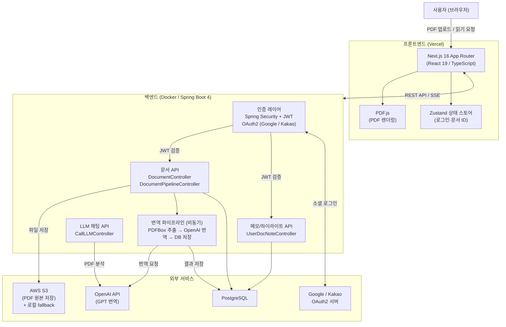
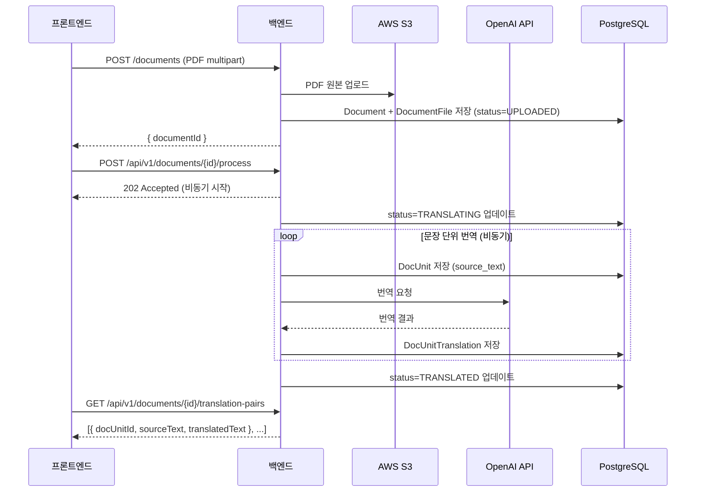

# 시스템 아키텍처

> Paper Dot — 영어 학술 논문 PDF 자동 번역 및 한·영 병렬 읽기 웹 시스템
>
> 논문 제목(임시): 영어 학술 문서를 문장 단위로 한·영 병렬 읽기/번역할 수 있는 웹 시스템의 설계 및 구현

---

## 1. 전체 시스템 구성도

---

## 2. 번역 파이프라인 흐름

---

## 3. API 핵심 엔드포인트 요약

### 인증

| Method | 경로 | 설명 |
|--------|------|------|
| GET | `/oauth2/authorization/{provider}` | OAuth 로그인 시작 (provider: google, kakao) |
| GET | `/login/oauth2/code/{provider}` | OAuth 콜백 (Spring Security 자동 처리) |
| POST | `/auth/logout` | 로그아웃 (리프레시 토큰 무효화) |
| DELETE | `/auth/withdraw/{socialType}` | 회원 탈퇴 (소셜 연동 해제 포함) |

### 문서 업로드

| Method | 경로 | 설명 |
|--------|------|------|
| POST | `/documents` | PDF 업로드 (multipart/form-data) → S3 저장 + DB 메타데이터 등록 |

### 문서 처리 파이프라인

| Method | 경로 | 설명 |
|--------|------|------|
| POST | `/api/v1/documents/{id}/process` | 번역 파이프라인 비동기 실행 |
| GET | `/api/v1/documents/{id}/translation-pairs` | 원문·번역 문장 쌍 전체 조회 |
| GET | `/api/v1/documents/{id}/translation-progress` | 번역 진행률 (상태별 unit 수) |
| GET | `/api/v1/documents/{id}/translation-status` | 번역 상태 폴링 (PENDING / STARTED / COMPLETED / FAILED) |
| GET | `/api/v1/documents/{id}/translation-events` | 번역 진행 SSE 이벤트 스트림 |
| GET | `/api/v1/documents/translation-histories` | 내 번역 완료 문서 목록 (`?ownerId={id}`) |

### 메모 / 하이라이트

| Method | 경로 | 설명 |
|--------|------|------|
| GET | `/api/v1/documents/{id}/notes` | 문서 내 전체 노트 조회 (JWT 인증 필요) |
| POST | `/api/v1/documents/{id}/notes` | 노트 추가 (noteType: HIGHLIGHT \| MEMO) |
| PUT | `/api/v1/documents/{id}/notes/{noteId}` | 노트 수정 |
| DELETE | `/api/v1/documents/{id}/notes/{noteId}` | 노트 삭제 |

### LLM 채팅

| Method | 경로 | 설명 |
|--------|------|------|
| POST | `/api/llm/chat-pdf` | PDF 파일 기반 GPT 채팅 응답 |

---

## 4. DB 테이블 개요

### users

| 컬럼 | 타입 | 설명 |
|------|------|------|
| id | BIGINT PK | 사용자 ID |
| email | VARCHAR(255) | 이메일 |
| nickname | VARCHAR(100) | 닉네임 |
| profile_image_url | VARCHAR(1000) | 프로필 이미지 |
| created_at / updated_at | TIMESTAMPTZ | 생성·수정 시각 |

### social_accounts

| 컬럼 | 타입 | 설명 |
|------|------|------|
| id | BIGINT PK | — |
| user_id | BIGINT FK → users | 연결된 사용자 |
| provider | VARCHAR(20) | GOOGLE \| KAKAO |
| provider_user_id | VARCHAR(255) | 소셜 플랫폼 고유 ID |
| provider_refresh_token | VARCHAR(2000) | OAuth 리프레시 토큰 (revoke용) |
| linked_at / last_login_at | TIMESTAMPTZ | 연동·최근 로그인 시각 |

### documents

| 컬럼 | 타입 | 설명 |
|------|------|------|
| id | BIGINT PK | 문서 ID |
| owner_id | BIGINT | 소유자 (users.id) |
| title | VARCHAR | 문서 제목 |
| language_src / language_tgt | CHAR(2) | 원본·번역 언어 코드 (en, ko 등) |
| total_pages | INT | PDF 총 페이지 수 |
| status | VARCHAR | UPLOADED \| TRANSLATING \| TRANSLATED \| FAILED |
| last_opened_at | TIMESTAMPTZ | 마지막 열람 시각 |

### document_files

| 컬럼 | 타입 | 설명 |
|------|------|------|
| id | BIGINT PK | — |
| document_id | BIGINT FK → documents | 소속 문서 |
| file_type | VARCHAR | ORIGINAL_PDF \| TRANSLATED_PDF |
| storage_provider | VARCHAR | S3 \| LOCAL |
| storage_path | VARCHAR | 오브젝트 스토리지 경로 |
| original_filename | VARCHAR | 업로드 원본 파일명 |
| mime_type | VARCHAR | 파일 MIME 타입 |
| file_size_bytes | BIGINT | 파일 크기 |
| checksum_sha256 | CHAR(64) | 무결성 체크섬 |
| uploaded_at | TIMESTAMPTZ | 업로드 시각 |

### doc_units

| 컬럼 | 타입 | 설명 |
|------|------|------|
| id | BIGINT PK | 문서 단위 ID (docUnitId — FE에서 하이라이트 키로 사용) |
| document_id | BIGINT | 소속 문서 |
| unit_type | VARCHAR | 문단 유형 (PARAGRAPH 등) |
| order_in_doc | INT | 문서 내 순서 |
| source_text | TEXT | 원문 텍스트 |
| status | VARCHAR | PENDING \| TRANSLATED \| FAILED |
| created_at | TIMESTAMPTZ | 생성 시각 |

### doc_unit_translations

| 컬럼 | 타입 | 설명 |
|------|------|------|
| id | BIGINT PK | — |
| doc_unit_id | BIGINT FK → doc_units | 원문 단위 |
| target_lang | VARCHAR | 번역 대상 언어 (ko 등) |
| translated_text | TEXT | 번역 결과 텍스트 |
| created_at | TIMESTAMPTZ | 번역 완료 시각 |

### user_doc_notes

| 컬럼 | 타입 | 설명 |
|------|------|------|
| id | BIGINT PK | — |
| user_id | BIGINT | 노트 작성자 |
| document_id | BIGINT | 대상 문서 |
| doc_unit_id | BIGINT | 대상 문서 단위 |
| note_type | VARCHAR(20) | HIGHLIGHT \| MEMO |
| content | TEXT | 메모 내용 (HIGHLIGHT 시 선택된 텍스트) |
| color | VARCHAR(20) | 하이라이트 색상 코드 |
| created_at | TIMESTAMPTZ | 생성 시각 |

> 인덱스: `(user_id, document_id)` 복합 인덱스 적용

---

## 5. 프론트엔드 주요 라우트 및 컴포넌트

| 경로 | 설명 | 핵심 컴포넌트 |
|------|------|---------------|
| `/` | 홈 (서비스 소개, 데모) | `app/page.tsx`, `MainScreen*` |
| `/login` | Google / Kakao OAuth 로그인 | `app/login/page.tsx` |
| `/newdocument` | PDF 업로드 + 번역 요청 + 진행 대기 | `NewDocument.tsx` |
| `/read` | 한·영 병렬 읽기 화면 | `Read.tsx`, `ReadList.tsx` |
| `/mypage` | 내 문서 목록, 계정 관리, 회원 탈퇴 | `mypage/ui/*` |
| `/api/auth/token` | OAuth 토큰 수신 프록시 | Next.js API Route |

---

## 6. 기술 스택 및 선정 이유

| 구분 | 기술 | 선정 이유 |
|------|------|----------|
| **FE 프레임워크** | Next.js 16 (App Router) | SSR/CSR 혼용, API Routes로 OAuth 콜백 처리, Vercel 배포 최적화 |
| **상태 관리** | Zustand | Redux 대비 보일러플레이트 최소화, 필요한 컴포넌트만 구독 가능 |
| **PDF 렌더링** | PDF.js | 브라우저 네이티브 PDF 렌더링, 텍스트 레이어 추출 지원 |
| **스타일링** | Tailwind CSS 4 + CSS Modules | 유틸리티 클래스로 빠른 개발, 컴포넌트 단위 스코프 격리 |
| **BE 프레임워크** | Spring Boot 4 / Java 17 | JPA·Security·OAuth2 생태계 성숙, 비동기 파이프라인 구현 용이 |
| **DB** | PostgreSQL | 관계형 데이터 모델(문서-단위-번역 1:N), JSONB 확장 가능 |
| **번역 엔진** | OpenAI GPT API | 학술 문어체 번역 품질, 문장 단위 배치 처리 가능 |
| **PDF 텍스트 추출** | Apache PDFBox | Java 네이티브, 페이지·단락 단위 추출 지원 |
| **스토리지** | AWS S3 + 로컬 fallback | 운영 환경은 S3, 개발 환경은 로컬 파일 시스템으로 전환 가능 |
| **인증** | Spring Security OAuth2 + JWT | 소셜 로그인(Google/Kakao) 표준 흐름, 액세스/리프레시 토큰 분리 |

---

## 7. 환경 변수 요약

### Frontend (`.env.local`)

| 변수 | 예시 | 설명 |
|------|------|------|
| `NEXT_PUBLIC_API_URL` | `http://localhost:8080` | 백엔드 API 기준 URL (미설정 시 localhost:8080 사용) |

### Backend (`.env`)

| 변수 | 설명 |
|------|------|
| `JWT_SECRET` | JWT 서명 시크릿 |
| `AWS_ACCESS_KEY_ID` / `AWS_SECRET_ACCESS_KEY` | S3 인증 |
| `AWS_REGION` / `AWS_S3_BUCKET` | S3 버킷 설정 |
| `LOCAL_STORAGE_ROOT` | S3 미설정 시 로컬 저장 경로 |
| `OPENAI_API_KEY` | OpenAI API 키 |
| `GOOGLE_CLIENT_ID` / `GOOGLE_CLIENT_SECRET` | Google OAuth |
| `KAKAO_CLIENT_ID` / `KAKAO_CLIENT_SECRET` | Kakao OAuth |
| `SPRING_DATASOURCE_URL` | PostgreSQL 연결 URL |
